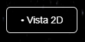
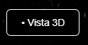
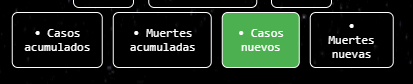
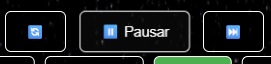
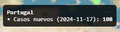

# Representación de datos COVID-19 🦠📊

## Índice

- [Tarea Propuesta](#tarea-propuesta)
- [Implementación](#implementación)
  - [Datos cargados](#datos-cargados)
  - [Representación de datos](#representación)
  - [Vistas](#vistas)
  - [Botones](#botones)
    - [Representación de datos](#alternar-entre-datos)
    - [Flujo de la representación](#flujo-de-la-representación)
- [Clasificación de países](#ranking)
- [Implementaciones adicionales](#implementaciones-adicionales)
- [Enlace al código](#enlace-al-código)
- [Referencias](#referencias)

## Tarea Propuesta

Este proyecto consiste en una visualización de datos sobre contagios y muertes de la COVID-19 para observar su evolución desde la declaración de los primeros casos hasta el día de hoy.

## Implementación

### Datos cargados

Hacemos uso de datos de la COVID-19 actualizados semanalmente por la [OMS](https://data.who.int/dashboards/covid19/data). Principalmente, hacemos uso de los datos referentes a declaración de nuevos casos y muertes, así como también del total acumulado.

Haciendo uso de ambos datos, podemos observar que países han sido más azotados por los contagios según el total acumulado, así como ver la propagación del virus con los casos y muertes declaradas semanalmente.

### Representación

A la hora de visualizar los datos, hemos decidido representar los casos/muertes como "bins" de histograma, creciendo y decreciendo segúnel número de nuevos casos/muertes.

Para ello, hacemos uso de las siguientes funciones:
- **latLonToPlane**/**latLonToSphere**: utilizada para transformar las coordenadas geográficas de los países a coordenadas de plano o esfera respectivamente.
- **createMarkers**: para la creación inicial de la posicion de los histogramas vacíos (inicialmente invisibles).
- **updateMarkers**: encargado de actualizar los datos para la correcta visualización de los datos en los bins de histograma. Según los datos aumenten o decrecen, esta evolución se ve reflejada en el tamaño del histograma.

### Vistas

Para la visualización de los datos, puede hacerse uso de una de las dos vistas implementadas:

- Vista 2D: consiste en un mapa del mundo (plano) en el que se representan los datos.

- Vista 3D: representamos el planeta Tierra en 3D para tener una visualización extraterrestre.

#### Botones

##### Alternar entre datos

Se han implementado diferentes botones para alternar entres distintas visualizaciones de datos, haciendo posible de esta forma aislar casos y muertes semanales de sus equivalentes acumulados.

##### Flujo de la representación

De igual manera, para poder controlar aún más el flujo de la representación de los datos, se han implementado tres botones que permiten reiniciar, pausar y avanzar de semana.

- 🔄 Reiniciar: reinicia la representación al estado inicial.

- ▶️ Reanudar/⏸️ Pausar: congela la representación para permitir analizar mejor los datos en la fecha deseada.

- ⏭️ Avance: permite, combinado con la representación pausada, cambiar de fecha para ver el avance.

### Ranking

Cabe destacar además que para enriquecer el proceso de visualización, se ha añadido una clasificación de los 10 países que más nuevos casos/muertes o casos/muertes acumuladas llevan hasta la fecha indicada.

## Implementaciones adicionales

Adicionalmente, se han añadido funciones complementarias para complementar la implementación mínima. Entre estas, destacamos:

- **colourByCountry**: genera un color único para cada país basándose en su nombre al hacer uso de un hash numérico. De esta forma, cada histograma tiene un color distintivo sin necesidad de crearnos una lista fija de colores.
- **highlightActiveMetric**: se encarga de resaltar visualmente (color verde) qué métrica está seleccionada en la interfaz de selección (nuevos casos, nuevas muertes...).
- **showTooltip**: haciendo uso de un raycaster, cuando se pulsa sobre uno de los histogramas representantes de los países, devuelve el valor exacto de casos/muertes que se está mostrando en ese momento.

    

## Enlace al código

Para acceder al repositorio de codesandbox haga uso del siguiente link: https://codesandbox.io/p/sandbox/visualizacion-de-datos-covid-19-entregable-final-4ymtxg
## Referencias

- [Documentación Threejs](https://threejs.org/docs)
- [Solar System Scope Textures](https://www.solarsystemscope.com/textures)
- [Earth Textures](https://gis.humboldt.edu/Archive/GISData/2019/WGS84_Geographic/3DTextures)
- [COVID-19 data - WHO](https://data.who.int/dashboards/covid19/data)
- [Geographic Coordinates dataset](https://www.kaggle.com/datasets/paultimothymooney/latitude-and-longitude-for-every-country-and-state)
